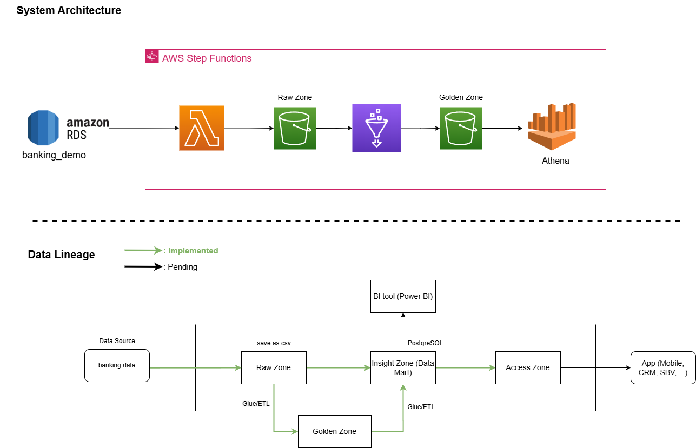
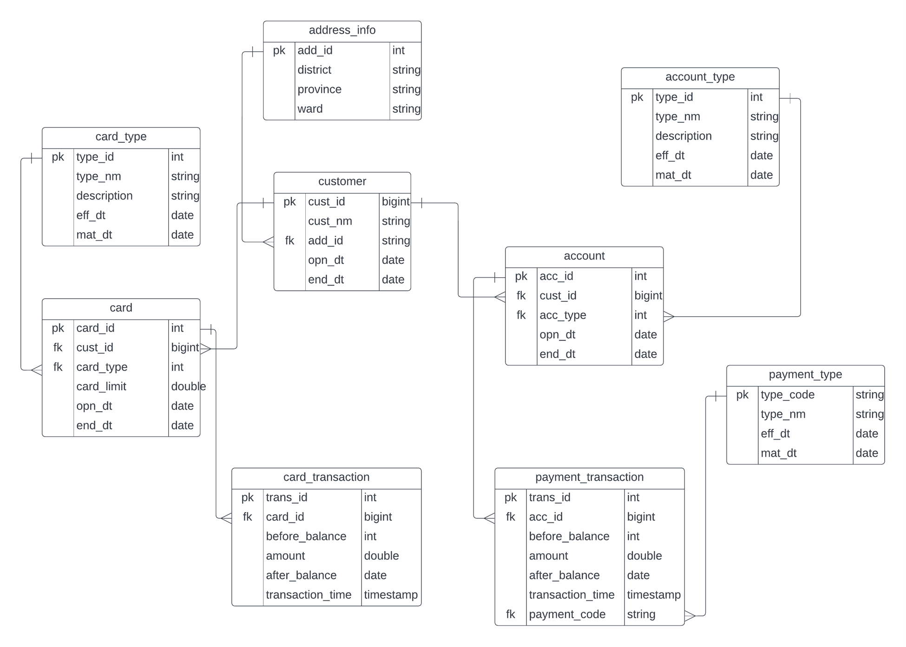
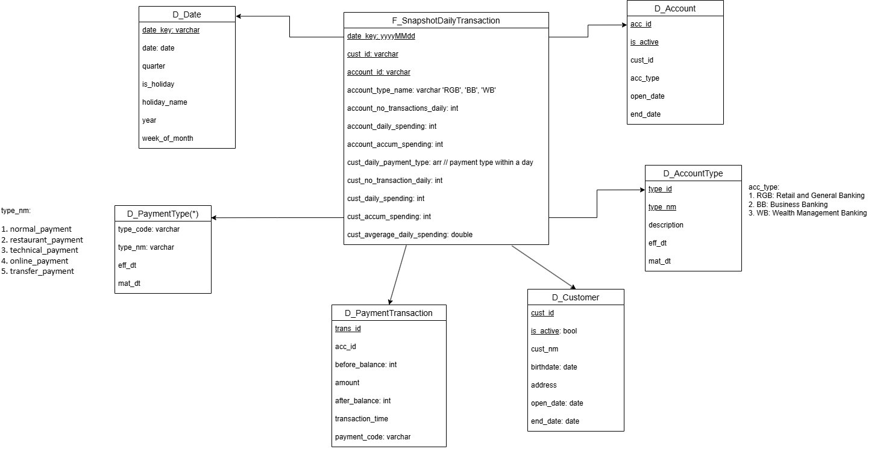
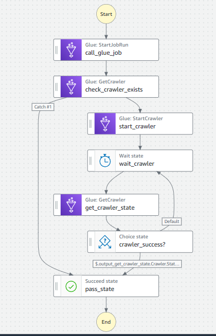

# Banking ETL pipeline using AWS
## Description
This project performed the daily ETL process from the banking data source to the data warehouse with a strong focus on the data modelling in the data warehouse.

## Pipeline Overview

### Implemented
This project used `AWS Step Function` to orchestrate the ETL process which pulls the data from `AWS RDS` (PostgreSQL) to `S3` as a raw zone.

Then, a `PySpark Glue Job` is used to transform the csv data in `S3` raw zone into dim/fact tables in `S3` golden zone. From here, These tables can be further transformed into insight tables using Glue Job PySpark, extracting valuable information from the raw data. 

### Future work
For data visualization, Metabase can be employed to enhance the analysis. However, this feature has not been implemented in the current version of the project.

## Data modelling
- **Data source**: In the banking context, the transactions are divided into 2 methods: cash or digital transactions. These source tables are designed and organized around both concepts
    

- **Data warehouse**: following the star schema design, with the fact table being of the snapshot type, which recorded both daily and accumulated metrics for each customer's transaction
    

# Details
- S3: created 2 buckets for Raw Zone and Golden Zone
- Sample Step function:
    
